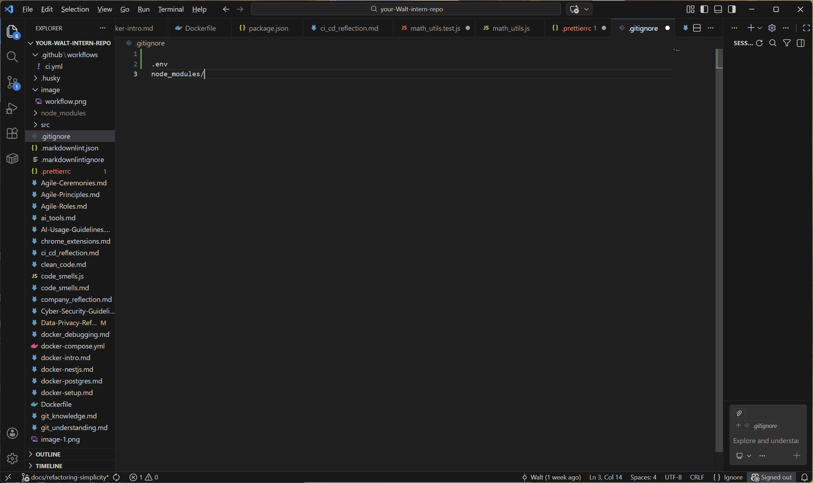

# Data Privacy & Confidentiality Reflection

## Goal
To understand how to handle sensitive data responsibly and follow Focus Bear’s privacy and confidentiality policies.

## Research & Learn

### 1. What types of data are considered confidential at Focus Bear?
* **User PII (Personally Identifiable Information):** Names, email addresses, and profile pictures.
* **Usage Data:** Specific habits, focus session logs, and blocked apps lists (this reveals user behavior patterns).
* **Technical Secrets:** API Keys (Stripe, OpenAI), database credentials, and internal source code algorithms.
* **Business Data:** Internal roadmaps, unreleased features, and financial metrics.

### 2. What are best practices for handling confidential data?
* **Least Privilege:** Only access data that is strictly necessary for the current task.
* **Encryption:** Ensure data is encrypted at rest (database) and in transit (HTTPS/TLS).
* **No Hardcoding:** Never commit passwords or API keys to GitHub; use `.env` files instead.
* **Secure Sharing:** Use password managers (like 1Password) to share credentials, never via Slack/Email plain text.

### 3. How should you respond to a suspected data breach or accidental disclosure?
* **Immediate Reporting:** Notify the CTO or Data Protection Officer immediately. Do not try to hide it.
* **Containment:** If possible, disconnect the compromised system or revoke the leaked credential immediately.
* **Documentation:** Record exactly what happened, when it happened, and what data might be affected.

## Reflection

### 1. What steps can you take to ensure you handle data securely in your daily tasks?
* **Git Vigilance:** Always check `git status` before committing to ensure no `.env` files or local config files are included.
* **Screen Security:** Lock my computer whenever I step away from the desk.
* **Clean Desktop:** Do not store user data dumps (CSV/JSON) on my local desktop; use the secure development database instead.

### 2. How should you store, share, and dispose of sensitive information safely?
* **Store:** In secure, access-controlled databases or encrypted cloud storage (Google Drive with strict permissions).
* **Share:** Use ephemeral links (e.g., 1Password sharing links) that expire after one view.
* **Dispose:** When testing is done, delete local test databases and scrub any temporary files securely.

### 3. What are some common mistakes that lead to data privacy issues?
* **Hardcoding Secrets:** Accidentally pushing API keys to a public GitHub repository.
* **Weak Passwords:** Using "123456" or reusing passwords across accounts.
* **Phishing:** Clicking on suspicious links in emails that look like system alerts.
* **Over-sharing:** Posting screenshots of code or database tables on social media or public forums.

##  Task: My Commitment
**I will adopt the following habit to improve data security:**
I will verify my `.gitignore` file effectively excludes all environment variables and sensitive configuration files before every commit. I will also enable 2FA (Two-Factor Authentication) on all my work accounts immediately.

## Screenshot Evidence
