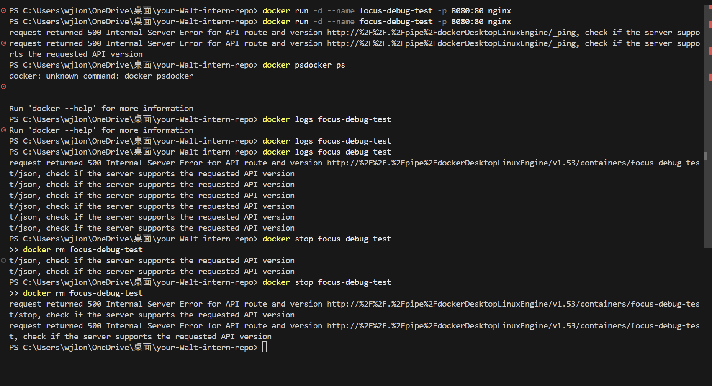

# Debugging and Managing Docker Containers

## Goal

To learn how to inspect, debug, and manage running Docker containers.

## Reflection

### 1. How can you check logs from a running container?

Use the `docker logs` command.

* **View all logs:** `docker logs <container_name>`
* **Follow logs in real-time:** `docker logs -f <container_name>`
* **View last N lines:** `docker logs --tail 100 <container_name>`

### 2. What is the difference between `docker exec` and `docker attach`?

* **docker exec:**
    Creates a **new process** (e.g., `/bin/bash`) inside the container.
  * **Safety:** Exiting the shell does NOT stop the container.
  * **Use Case:** Debugging, checking files, installing tools.

* **docker attach:**
    Connects your terminal to the **main process** (PID 1) of the container.
  * **Risk:** Pressing `Ctrl+C` sends a kill signal to PID 1, stopping the container.
  * **Use Case:** Viewing the application's stdout/stderr directly.

### 3. How do you restart a container without losing data?

Data inside a container is ephemeral. To keep data safe, use **Volumes**.

* **If using Volumes:**
    Running `docker rm` followed by `docker run -v my_vol:/data ...` keeps
    your data intact because it lives on the host machine.

* **If NOT using Volumes:**
    `docker restart` is safe, but `docker rm` will delete all data.

### 4. Troubleshooting Database Connections in Docker

If your App container cannot connect to your DB container:

1. **Check Network:** Are they on the same network?
    Run `docker network inspect bridge`.
2. **Check Hostname:** Do NOT use `localhost`.
    Use the service name (e.g., `postgres` or `db`) defined in compose.
3. **Check Environment:** verify connection strings.
    Run `docker exec <app_container> env`.

## Evidence

I successfully performed the following actions:

1. Started an Nginx container: `docker run -d --name focus-debug-test nginx`
2. Verified status: `docker ps`
3. Checked logs: `docker logs focus-debug-test`
4. Entered shell: `docker exec -it focus-debug-test sh`
5. Cleaned up: `docker stop focus-debug-test && docker rm focus-debug-test`

